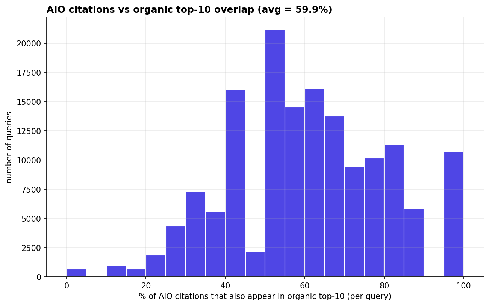
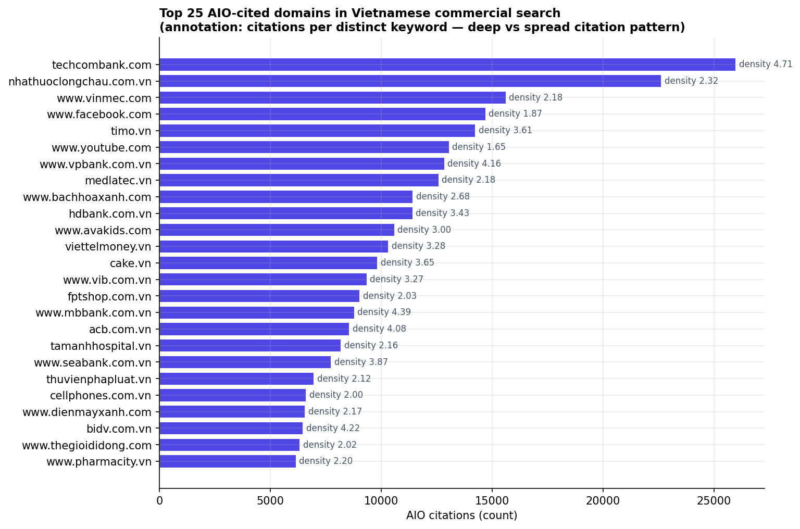
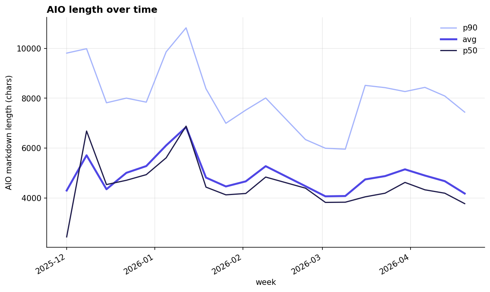
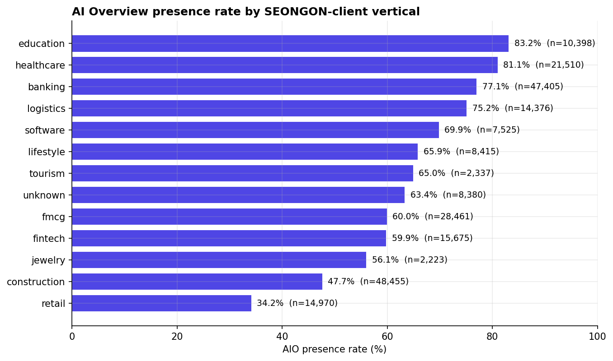
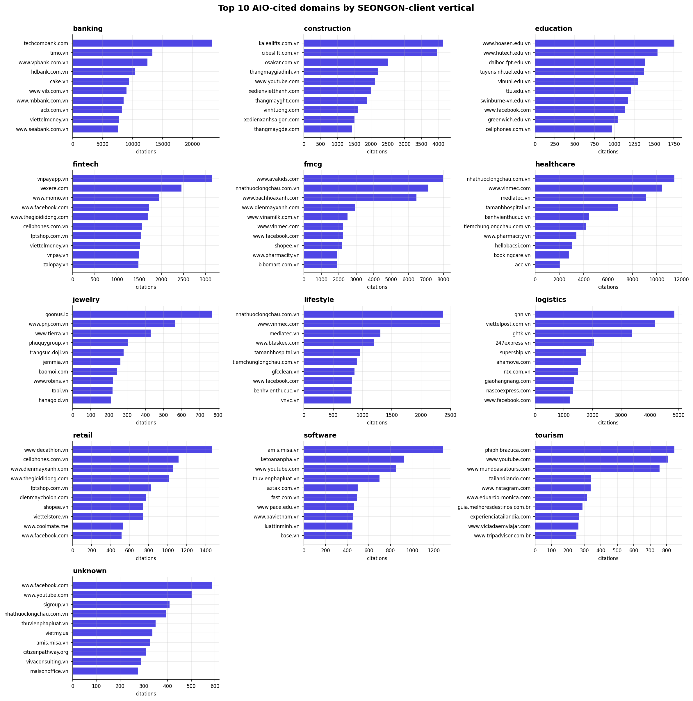
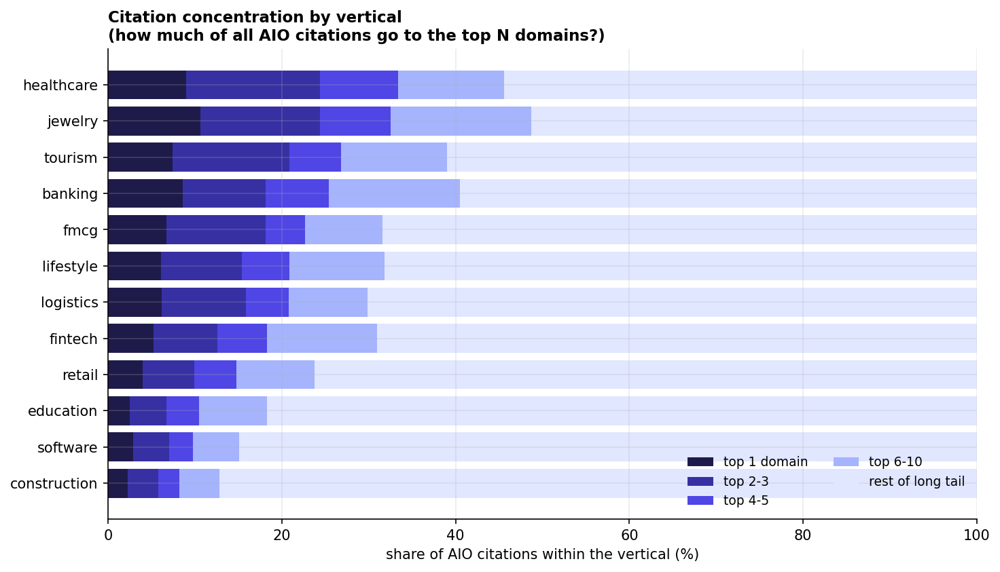

# Atlas — preliminary findings

Six findings on the cleaned 231,365-row corpus (244K raw → 231K after dropping
synthetic queries and brand-name-bearing client queries). Numbers are
preliminary and will be re-reported in the final publication with confidence
intervals and sensitivity analysis.

Reproduce: `uv run python scripts/run_findings.py`. All six charts regenerate
into `charts/`.

---

## F1 — AI Overviews appear 2.5× more often on long-tail queries than head terms

The relationship between query length and AIO presence is **monotonic and
dramatic**. Queries of 10+ words get an AI Overview **80.8% of the time**;
queries of 1–2 words only 32.8%.

| query length | rows | AIO rate |
|---|---:|---:|
| 1–2 words | 5,353 | **32.8%** |
| 3–4 words | 50,955 | 46.0% |
| 5–6 words | 90,211 | 64.6% |
| 7–9 words | 74,818 | 75.4% |
| 10+ words | 10,028 | **80.8%** |

This contradicts a popular SEO assumption that AIO is mostly a "big
informational head-term" feature. In the Vietnamese commercial market it is
the **long tail** that gets AIO most consistently.

---

## F2 — 40% of AI Overview citations come from outside the organic top 10

Across 153,052 AIO-positive SERPs, the average AI Overview cites 7.38
distinct domains, while the same SERP's organic top 10 contains 7.77
distinct domains, with an average overlap of 4.23. Net result:

> **59.9% of AIO-cited domains also rank in organic top 10.**
> **40.1% of AIO citations come from outside the top 10 — or aren't organically ranked for that query at all.**

Mirrors the iPullRank / Surfer SEO finding for the English market. First
time it has been measured at this scale for Vietnamese.

---

## F3 — Banks own their queries deeply. UGC platforms get cited thinly. (New finding.)

Top 25 cited AIO domains, with citation density (`citations / distinct keywords`):
density > 4 means the domain is cited multiple times for the same query
(deep authority). Density near 1 means it is cited once across many queries
(thin breadth).

| domain | citations | distinct kws | density |
|---|---:|---:|---:|
| techcombank.com | 25,991 | 5,513 | **4.71** |
| nhathuoclongchau.com.vn | 22,639 | 9,765 | 2.32 |
| www.vinmec.com | 15,634 | 7,166 | 2.18 |
| www.facebook.com | 14,719 | 7,878 | **1.87** |
| timo.vn | 14,255 | 3,950 | 3.61 |
| www.youtube.com | 13,070 | 7,924 | **1.65** |
| www.vpbank.com.vn | 12,862 | 3,094 | 4.16 |
| www.mbbank.com.vn | 8,797 | 2,003 | **4.39** |
| acb.com.vn | 8,579 | 2,103 | 4.08 |
| www.seabank.com.vn | 7,757 | 2,003 | 3.87 |

**The pattern is clean:** Vietnamese banks (TCB, MB, VPBank, ACB, SeABank,
HDBank) sit at densities of 3.4–4.7 — Google's AIO cites them several times
within the same answer. UGC platforms (Facebook 1.87, YouTube 1.65) are
present in many SERPs but rarely cited deeply. There is a measurable AIO
**devaluation of UGC content** relative to specialist domains.

---

## F4 — AI Overview length is roughly stable over five months (null finding)

Weekly average AIO length across Dec 2025 → April 2026: drift from 4,297
chars in the first week to 4,177 chars in the last week (−2.8%). Real but
small. **Not strong enough to claim AIOs are getting more concise.** Worth
publishing as a null result so future studies have a baseline.

---

## F5 — AIO presence rate varies dramatically by client vertical

| vertical | rows | AIO rate |
|---|---:|---:|
| education | 10,398 | **83.2%** |
| healthcare | 21,510 | 81.1% |
| banking | 47,405 | 77.1% |
| logistics | 14,376 | 75.2% |
| software | 7,525 | 69.9% |
| lifestyle | 8,415 | 65.9% |
| tourism | 2,337 | 65.0% |
| fmcg | 28,461 | 60.0% |
| fintech | 15,675 | 59.9% |
| jewelry | 2,223 | 56.1% |
| construction | 48,455 | 47.7% |
| retail | 14,970 | **34.2%** |

**Information-heavy verticals** (education, healthcare, banking) trigger AIO
the most. **Commercial / transactional verticals** (retail, construction,
jewelry) the least. The ~50pp spread between education (83%) and retail
(34%) is one of the strongest signals in the dataset.

---

## F6 — Each vertical has its own AIO citation hierarchy

Top 10 cited domains within each major client vertical. Useful for any VN
brand asking *"who am I actually competing with for AIO citation in my
vertical?"*

Highlights:

- **Banking:** Techcombank (23K) → Timo (13K) → VPBank (12K) → HDBank (10K) → Cake (9K)
- **Healthcare:** Long Châu (11K) → Vinmec (10K) → Medlatec (9K) → Tâm Anh (7K) → Thu Cúc (4.5K)
- **Logistics:** GHN (4.9K) → Viettel Post (4.2K) → GHTK (3.4K) → 247Express → Supership
- **Education:** Hoa Sen → HUTECH → FPT University → UEL → VinUni — universities own AIO
- **Software:** Misa AMIS → Kế toán An Phá → AZTAX — accounting tooling dominates
- **Jewelry:** Goonus.io → PNJ → Tierra → DOJI

---

## F7 — Citation concentration varies dramatically by vertical (new)

For each vertical, what share of total AIO citations goes to the top 1, top
3, top 5, and top 10 domains? Higher concentration = winner-take-all market.
Lower concentration = long-tail diversity.

| vertical | top-1 domain | top-1 % | top-5 % | top-10 % | distinct domains |
|---|---|---:|---:|---:|---:|
| jewelry | goonus.io | 10.6% | 32.5% | **48.7%** | 278 |
| healthcare | nhathuoclongchau.com.vn | 9.0% | 33.4% | **45.6%** | 2,658 |
| banking | techcombank.com | 8.6% | 25.4% | 40.5% | 3,420 |
| tourism | phiphibrazuca.com | 7.4% | 26.8% | 39.0% | 687 |
| fmcg | www.avakids.com | 6.7% | 22.7% | 31.6% | 2,877 |
| logistics | ghn.vn | 6.2% | 20.8% | 29.9% | 3,458 |
| lifestyle | nhathuoclongchau.com.vn | 6.1% | 20.9% | 31.8% | 1,325 |
| fintech | vnpayapp.vn | 5.2% | 18.3% | 31.0% | 1,870 |
| retail | www.decathlon.vn | 4.0% | 14.8% | 23.8% | 3,039 |
| education | www.hoasen.edu.vn | 2.5% | 10.5% | 18.3% | 1,651 |
| software | amis.misa.vn | 2.9% | 9.8% | 15.1% | 4,856 |
| construction | kalealifts.com.vn | 2.3% | 8.2% | **12.8%** | 7,762 |

**Two clean clusters:**

- **Concentrated markets** (top-10 owns ~40–50% of citations): jewelry,
  healthcare, banking, tourism. Brand recall and editorial authority matter.
  Breaking in is hard; defending share is easier.
- **Long-tail markets** (top-10 owns < 25%): construction, software,
  education, retail. Many small players, fragmented authority. Easier to
  enter; harder to defend.

The construction vertical is the most striking outlier: 7,762 distinct
domains cited, but the top-10 only captures **12.8%** of citations. AIO is
genuinely pulling from a long tail in construction-related queries.

---

## Methodology notes

- **Cleaning:** dropped ~5.3% of rows where the keyword references a SEONGON
  client brand (anonymization); dropped ~0.0% of rows for malformed/synthetic
  keywords (LLM test queries, leading dots, bare numerals).
- **Vertical taxonomy:** 14 verticals, mapped via brand_domain + brand_name +
  project name substring matching. Coverage: 96.4% of cleaned rows (3.6%
  remain in the residual `unknown` bucket).
- **Time range:** December 2, 2025 → April 24, 2026 (~5 months).
- **Sample sizes:** disclosed per finding; minimum bucket size 1,000 rows.

For the methodology in full, see [PLANNING.md](./PLANNING.md). For the
publication-grade version of these findings (with confidence intervals,
sensitivity analysis, and the full report sections), see the upcoming
[Atlas report](https://aio-atlas.seongon.com) (forthcoming).
