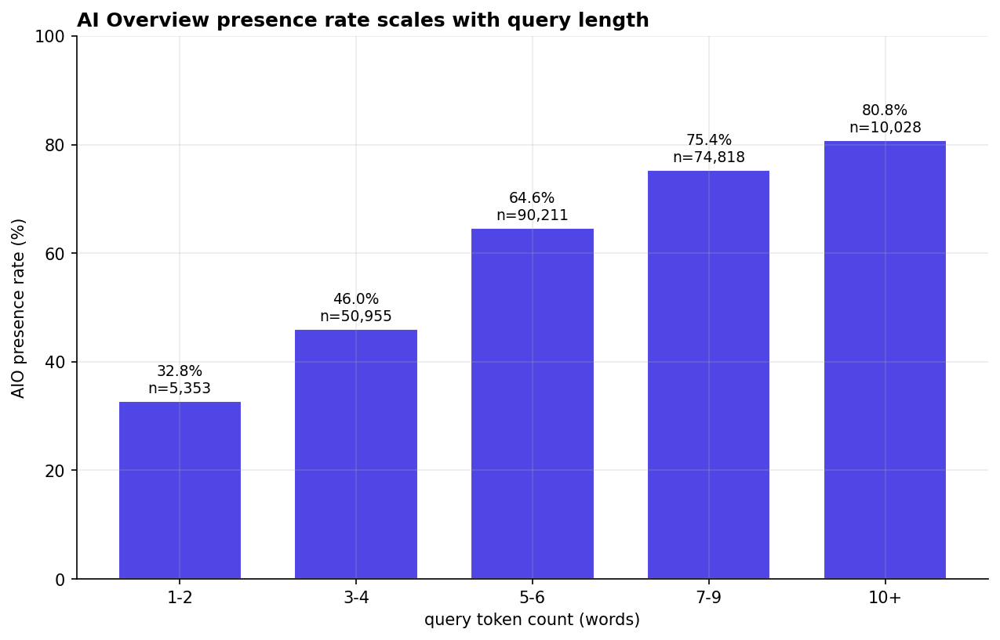

# Vietnam AI Overview Atlas

**An empirical study of how Google's AI Overviews behave on Vietnamese commercial search.** Backed by 244,323 query observations and 1.4 million citation events from December 2025 through April 2026, across 264 brand projects spanning 12 commercial verticals.

> **🚀 Live dashboard:** [vn-aio-atlas-dashboard-production.up.railway.app](https://vn-aio-atlas-dashboard-production.up.railway.app) — interactive, with per-vertical filtering and Vietnamese translation
>
> **📄 Full report:** [REPORT.md](./report/REPORT.md) (English) / [REPORT_vi.md](./report/REPORT_vi.md) (Tiếng Việt)
>
> **📊 Findings doc:** [FINDINGS.md](./FINDINGS.md) (10 findings, charts inline)

---

## Why this exists

Most published advice to Vietnamese brands and agencies on AI Overviews is anecdotal — single-keyword case studies, English-market analysis extrapolated to Vietnamese, or vague best-practice lists. By April 2026, AI Overview is on **63% of Vietnamese commercial queries** and rising. The implications are large enough that brands should be making informed decisions, but most are working from incomplete information.

This study fills the gap. It draws on SEONGON's internal SERP-tracking pipeline — running continuously across 264 active client projects — to present the first scaled, empirical view of how AIO actually behaves in Vietnamese commercial search.

The intent is **measurement**, not advocacy. AIO is neither universally bad for Vietnamese brands nor universally good. The findings here are facts, not recommendations dressed up as facts.

## What's in the dataset

| Metric | Value |
|---|---|
| Total query observations | 244,323 |
| Distinct queries | 80,264 |
| AIO-positive observations | 154,428 (63%) |
| Distinct brand projects | 264 |
| Time range | 2025-12-02 → 2026-04-24 (~5 months) |
| AIO citation events | ~1.4 million |
| AIO-generated text in corpus | ~720 million characters |

Brands represented include Vinamilk, Techcombank, VIB, VPBank, HDBank, ACB, MB, Prudential, Vinmec, Medlatec, Tâm Anh, Hồng Ngọc, GHTK, Viettel Post, Decathlon, FPT Shop, and many more across banking, healthcare, retail, e-commerce, FMCG, education, logistics, construction, fintech, software, lifestyle, and tourism.

All published numbers are aggregated to vertical or domain level. No raw client SERPs are released.

## Headline findings

Ten findings on the cleaned 231,365-row corpus. Full breakdown in [FINDINGS.md](./FINDINGS.md); long-form analysis in [REPORT.md](./report/REPORT.md).

1. **Long-tail queries trigger AIO 2.5× more than head terms.** 1–2 word queries: 32.8% AIO. 10+ word queries: 80.8%.
2. **40% of AIO citations come from outside organic top 10.** Average AIO cites 7.4 distinct domains; ~4 rank in top 10.
3. **Banks own their queries deeply (citation density 4.7); UGC platforms cited thinly (1.6–1.9).** A measurable AIO devaluation of UGC.
4. **AIO length is stable over the 5-month window.** Null result, reported for the record.
5. **AIO presence varies dramatically by vertical.** Education 83% → retail 34%. ~50pp spread.
6. **Each vertical has its own citation hierarchy.** Banking owned by TCB/Timo/VPBank; healthcare by Long Châu/Vinmec/Medlatec; logistics by GHN/Viettel Post/GHTK.
7. **Citation concentration ranges from winner-take-all to long-tail.** Jewelry top-10 = 49% of citations; construction top-10 = only 13%.
8. **In long-tail verticals, ranking organically isn't enough.** Tourism: only 47% of AIO citations are in organic top-10. Healthcare: 67%.
9. **Sitelinks are the largest single signal of AIO citation.** URLs with sitelinks cited 3.1× more often than URLs without.
10. **Healthcare AIOs are 67% longer than jewelry AIOs.** Reflects E-E-A-T conservatism for YMYL queries.



## What this is not

- **Not a tracking SaaS.** Profound, Peec, AthenaHQ, HubSpot AEO already exist. This is a research artifact, not a product.
- **Not a tool.** The Atlas is a study, a dashboard, and a report. The two adjacent projects in this workspace ([vn-aio-predictor](../vn-aio-predictor), [vn-aio-simulator](../vn-aio-simulator)) are tooling that builds on the Atlas's findings.
- **Not raw data publication.** Where data appears, it's aggregated to the vertical or domain level. Client-identifying queries and per-client metrics never leave SEONGON.

## Architecture

```
SEONGON Supabase (source)        <- raw client SERP/AIO data, never published
        │
        ▼  scripts/run_pull.py
data/raw/*.parquet               <- local per-row cache (gitignored)
        │
        ▼  scripts/run_clean.py
data/clean/meta.parquet          <- anonymized + vertical-tagged
        │
        ▼  scripts/run_load.py
atlas.* schema (Railway PG)      <- analytical store, source of truth for findings
        │
        ▼  Next.js + Recharts
Live dashboard                   <- public-facing, reads atlas.f* tables
```

The Atlas's own analytical Postgres (Railway, schema `atlas`) holds the cleaned mirror tables, exploded citation graphs, and persisted findings tables F1–F10. The dashboard reads directly from `atlas.f*`.

Key Atlas tables:

- `atlas.projects` (331) — vertical-tagged client projects
- `atlas.keyword_results` (231,365) — cleaned, vertical-tagged query observations
- `atlas.aio_citations` (1,097,839) — exploded AIO citation events
- `atlas.aio_references` (1,340,918) — full reference URLs with snippet text
- `atlas.organic_top10` (1,162,363) — exploded top-10 organic events
- `atlas.organic_features` (179,201) — per-organic-result feature rows for cited-vs-uncited analysis
- `atlas.f1_*` through `atlas.f10_*` — persisted findings tables

## Reproducing the analysis

```bash
cd vn-aio-atlas
uv sync                                # install Python deps
cp .env.example .env                   # then fill in credentials

uv run python scripts/run_pull.py      # SEONGON Supabase -> data/raw/*.parquet
uv run python scripts/run_clean.py     # cleaning + anonymization + vertical tagging
uv run python scripts/run_load.py      # parquet -> Atlas Postgres + compute F1-F10
uv run python scripts/run_findings.py  # regenerate charts/ from data/clean
```

For the dashboard:

```bash
cd dashboard
cp .env.example .env.local             # set ATLAS_PG_URL
npm install
npm run dev                            # http://localhost:3000
```

## Project structure

```
vn-aio-atlas/
├── README.md           — this file
├── PLANNING.md         — original project plan + methodology
├── FINDINGS.md         — concise findings doc with all 10 charts
├── report/
│   ├── REPORT.md       — full English report (v0.2)
│   └── REPORT_vi.md    — Vietnamese version
├── charts/             — PNG charts referenced from docs
├── sql/
│   └── 01_schema.sql   — analytical Postgres schema
├── src/atlas/          — Python pipeline (pull, clean, load, findings)
├── scripts/            — runner scripts for the pipeline
├── dashboard/          — Next.js dashboard (deployed to Railway)
└── data/               — gitignored local data cache
```

## Status

**Draft v0.2.** All 10 findings validated, dashboard live, full report (English + Vietnamese) published. Awaiting SEONGON's legal/anonymization clearance for public promotion.

See [CHANGELOG.md](./CHANGELOG.md) for what's new in v0.2.

## About

A project led by **Hoang Duc Viet** (AI lead at [SEONGON](https://seongon.com)). The dataset is SEONGON's, used with permission for aggregated public publication. The methodology, code, analysis, and writing are mine.

For questions: [hoangducviet@seongon.com](mailto:hoangducviet@seongon.com) or [hoangducviet.work](https://hoangducviet.work).

## License

- **Report and findings:** [CC BY 4.0](https://creativecommons.org/licenses/by/4.0/) — share, adapt, but credit.
- **Code:** [MIT](./LICENSE).
- **Data:** Not publicly released. Aggregated derivatives only, as published in the report and dashboard.
